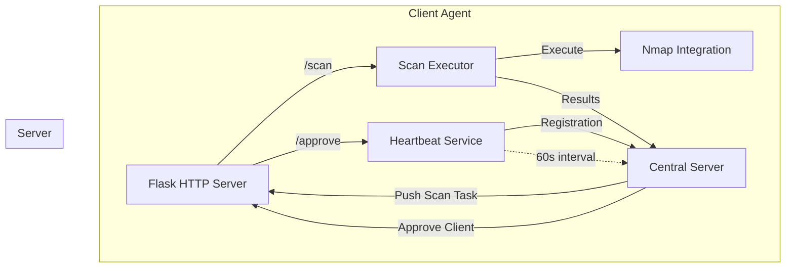
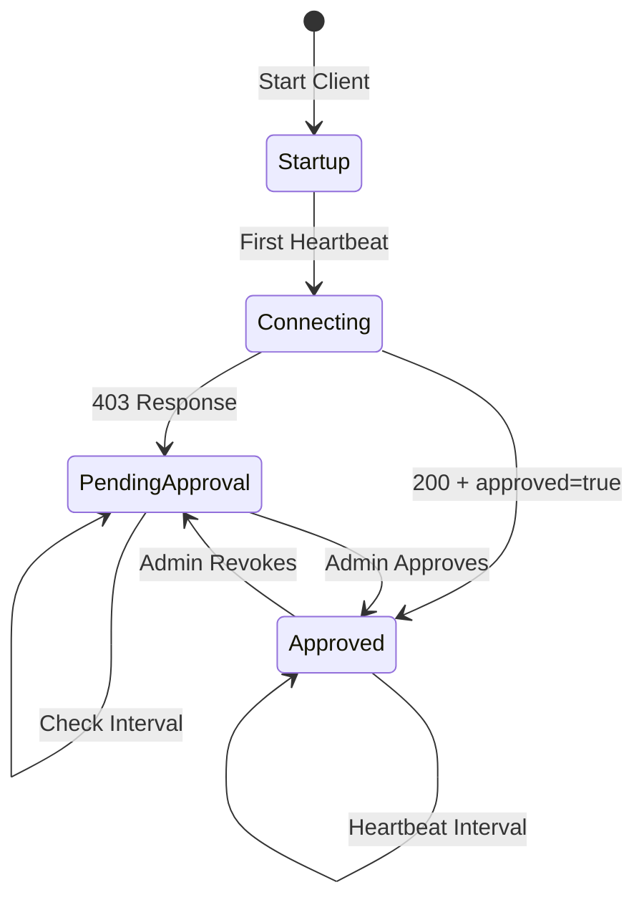

# Client Architecture & Internals
{: .no_toc }

Deep dive into the client agent's architecture, components, and internal mechanics for developers.
{: .fs-6 .fw-300 }

## Table of contents
{: .no_toc .text-delta }

1. TOC
{:toc}

---

## Overview

The Port Scanner Client Agent is built on a push-based architecture where the server initiates scan requests. The client maintains persistent connectivity through heartbeats and exposes HTTP endpoints for receiving tasks.

### Key Design Principles

- **Push-Based**: Server pushes tasks to client, not pull-based polling
- **Stateless Scans**: Each scan is independent and self-contained
- **Resilient**: Automatic retries and graceful error handling
- **Concurrent**: ThreadPoolExecutor for parallel scan execution
- **Approval-Gated**: Security layer requiring admin approval

---

## Architecture Diagram



---

## Core Components

### 1. PortScannerClient Class

The main orchestrator that manages all client operations.

#### Initialization Flow

```python
def __init__(self, config_file: str = "config.yml"):
    self.client_id = self._get_client_id()      # MAC address-based ID
    self.hostname = socket.gethostname()        # System hostname
    self.config = self._load_config()           # Load YAML config
    self.nm = nmap.PortScannerYield()          # Nmap instance
    self.registered = False                     # Registration state
    self.approved = False                       # Approval state
    
    # Thread pool for concurrent scans
    self.executor = ThreadPoolExecutor(max_workers=max_concurrent_scans)
    self.active_scans = {}                      # scan_id -> Future mapping
    
    # Flask app setup
    self.app = Flask(__name__)
    self._setup_routes()
    
    # Start heartbeat thread
    self._start_heartbeat()
```

**Key Design Decisions**:
- `client_id` uses MAC address for stable, unique identification
- ThreadPoolExecutor manages scan concurrency without manual thread handling
- Flask app runs in separate thread to avoid blocking
- Heartbeat starts immediately to register with server

#### Client ID Generation

```python
def _get_client_id(self) -> str:
    """Generate stable client identifier from MAC address"""
    # Fallback to hostname if MAC unavailable
    return socket.gethostname()
```

**Why MAC Address?**
- Persistent across reboots
- Unique per network interface
- Hardware-based identification
- Fallback to hostname ensures client always has ID

---

### 2. Flask HTTP Server

The client exposes several endpoints for server communication.

#### Endpoint Architecture

| Endpoint | Method | Purpose | Auth Required |
|----------|--------|---------|---------------|
| `/health` | GET | Health check and status | No |
| `/approve` | POST | Mark client as approved | No (server-to-client) |
| `/scan` | POST | Receive scan task | Yes (approved=true) |
| `/scan/<id>/cancel` | POST | Cancel running scan | Yes |
| `/scans` | GET | List active scans | No |
| `/system` | GET | System resource info | No |

#### Health Check Endpoint

```python
@self.app.route("/health", methods=["GET"])
def health_check():
    return jsonify({
        "status": "healthy",
        "client_id": self.client_id,
        "hostname": self.hostname,
        "approved": self.approved,              # Approval status
        "active_scans": len(self.active_scans), # Current workload
        "system_info": self.get_system_info()   # Resource usage
    })
```

**Used For**:
- Server health monitoring
- Load balancing decisions
- Debugging client state

#### Scan Request Endpoint

```python
@self.app.route("/scan", methods=["POST"])
def receive_scan_request():
    # 1. Verify client is approved
    if not self.approved:
        return jsonify({"error": "Client is not approved"}), 403
    
    # 2. Validate request data
    required_fields = ["scan_id", "targets", "ports"]
    
    # 3. Create ScanRequest dataclass
    scan_request = ScanRequest(...)
    
    # 4. Check for duplicate scan_id
    if scan_request.scan_id in self.active_scans:
        return jsonify({"error": "Scan already running"}), 409
    
    # 5. Submit to thread pool
    future = self.executor.submit(self.perform_scan, scan_request)
    self.active_scans[scan_request.scan_id] = future
    
    return jsonify({"status": "accepted"}), 202
```

**Request Flow**:
1. Server POSTs scan request
2. Client validates approval status
3. Scan submitted to ThreadPoolExecutor
4. Immediate 202 Accepted response
5. Scan executes asynchronously
6. Results posted back when complete

**Why 202 Accepted?**
- Scan is accepted but not complete
- HTTP standard for async operations
- Server doesn't wait for scan completion

---

### 3. Heartbeat Service

Maintains persistent connection and handles registration/approval.

#### Heartbeat Thread

```python
def _start_heartbeat(self):
    def heartbeat_loop():
        check_interval = self.config.get("check_approval_interval", 30)
        heartbeat_interval = self.config.get("heartbeat_interval", 60)
        startup = True
        
        while True:
            try:
                url = f"{server_url}/api/clients/{client_id}/heartbeat"
                data = {
                    "client_id": self.client_id,
                    "hostname": self.hostname,
                    "ip_address": self._get_ip_address(),
                    "port": self.config.get("client_port"),
                    "scan_range": self.scan_range,
                    "active_scans": len(self.active_scans),
                    "system_info": self.get_system_info(),
                    "capabilities": {
                        "max_concurrent_scans": ...,
                        "supported_scan_types": ["tcp", "udp", "syn"],
                        "nmap_version": ...
                    }
                }
                
                response = requests.post(url, json=data, timeout=5)
                
                # Handle approval status changes
                if response.status_code == 200:
                    self.approved = response.json().get("approved", False)
                elif response.status_code == 403:
                    self.approved = False
                    
            except Exception as e:
                logger.error(f"Heartbeat failed: {e}")
                
            time.sleep(heartbeat_interval)
    
    thread = threading.Thread(target=heartbeat_loop, daemon=True)
    thread.start()
```

#### Heartbeat States



**State Transitions**:
- `startup=True`: First heartbeat, log connection message
- `403 Response`: Client awaiting approval
- `200 + approved=true`: Client approved and operational
- `approved → not approved`: Approval revoked

**Why Separate Check Intervals?**
```python
check_approval_interval: 30   # Check approval status every 30s
heartbeat_interval: 60        # Send heartbeat every 60s
```
- Pending clients check more frequently
- Approved clients use longer intervals
- Reduces server load while maintaining responsiveness

---

### 4. Scan Execution Engine

Handles the actual port scanning using python-nmap.

#### ScanRequest Dataclass

```python
@dataclass
class ScanRequest:
    scan_id: str              # Unique scan identifier
    task_id: str              # Task identifier from server
    result_id: str            # Result storage identifier
    targets: List[str]        # IP addresses or hostnames
    ports: str                # Port specification (e.g., "1-1000")
    scan_type: str = "tcp"    # Scan type
    timeout: int = 300        # Overall scan timeout
    priority: int = 1         # Priority level (unused currently)
    scan_name: Optional[str] = None
    scan_arguments: Optional[str] = None  # Custom nmap args
```

**Immutable Design**:
- Uses `@dataclass` for clean structure
- Frozen after creation (thread-safe)
- Easy serialization to dict with `asdict()`

#### Scan Execution Flow

```python
def perform_scan(self, scan_request: ScanRequest):
    start_time = time.time()
    callback = ScanCallback()
    
    try:
        # 1. Double-check approval (security)
        if not self.approved:
            self._send_failure_result("Client is not approved")
            return
        
        # 2. Prepare nmap arguments
        scan_args = scan_request.scan_arguments
        targets_str = " ".join(scan_request.targets)
        ports_to_scan = scan_request.ports if scan_request.ports else None
        
        # 3. Execute scan with yield-based iteration
        for host, scan_result in self.nm.scan(
            hosts=targets_str,
            ports=ports_to_scan,
            arguments=scan_args,
            sudo=True,
            timeout=600
        ):
            # Process each host as it completes
            callback.callback_result(host, scan_result)
        
        # 4. Prepare result payload
        result_payload = {
            "scan_id": scan_request.scan_id,
            "status": "completed",
            "scan_duration": time.time() - start_time,
            "parsed_results": callback.parsed_results,
            "summary_stats": callback.summary_stats,
            "timestamp": datetime.now(timezone.utc).isoformat()
        }
        
        # 5. Send results to server
        self.send_scan_results(result_payload)
        
    except Exception as e:
        # Send failure notification
        self._send_failure_result(str(e))
    
    finally:
        # Cleanup active scan tracking
        del self.active_scans[scan_request.scan_id]
```

**Key Points**:
- **Yield-based scanning**: Results streamed as hosts complete
- **Per-host callbacks**: Process incrementally, not all at once
- **Approval re-check**: Security guard before expensive operation
- **Guaranteed cleanup**: `finally` block ensures scan removal

#### Why PortScannerYield?

```python
self.nm = nmap.PortScannerYield()

# Instead of blocking until all scans complete:
for host, result in self.nm.scan(...):
    callback.callback_result(host, result)
```

**Benefits**:
- Memory efficient for large target lists
- Early result processing
- Better progress tracking
- Reduced latency (first results available sooner)

---

### 5. ScanCallback Class

Processes and structures nmap results.

```python
class ScanCallback:
    def __init__(self):
        self.parsed_results = {}  # host -> structured data
        self.summary_stats = {
            "total_targets": 0,
            "scanned_targets": 0,
            "targets_up": 0,
            "targets_down": 0,
            "error_targets": 0,
            "total_open_ports": 0
        }
```

#### Result Extraction

```python
def _extract_scan_data(self, scan_results, target: str) -> Dict:
    result = {
        "target": target,
        "nmap": {
            "command_line": scan_results["nmap"].get("command_line"),
            "scaninfo": scan_results["nmap"].get("scaninfo"),
            "scanstats": scan_results["nmap"].get("scanstats")
        },
        "hostname": "",
        "state": "down",
        "addresses": {},
        "vendor": {},
        "open_ports": [],      # List of open port numbers
        "port_details": {},    # Detailed info per port
        "os_detection": None
    }
    
    target_data = scan_results["scan"].get(target, {})
    
    # Extract basic host info
    result["hostname"] = target_data.get("hostnames", [{}])[0].get("name", "")
    result["state"] = target_data.get("status", {}).get("state", "down")
    
    # Process ports for each protocol
    for proto in ["tcp", "udp"]:
        if proto in target_data:
            for port, port_info in target_data[proto].items():
                if port_info.get("state") == "open":
                    result["open_ports"].append(int(port))
                
                # Store detailed information
                result["port_details"][str(port)] = {
                    "protocol": proto,
                    "state": port_info.get("state"),
                    "name": port_info.get("name"),
                    "product": port_info.get("product"),
                    "version": port_info.get("version"),
                    "extrainfo": port_info.get("extrainfo"),
                    "cpe": port_info.get("cpe")
                }
    
    return result
```

**Data Structure Design**:
- **open_ports**: Quick list for filtering/counting
- **port_details**: Comprehensive info for detailed analysis
- **Separation of concerns**: Summary vs. detailed data

#### Why Store Both Lists and Details?

```python
"open_ports": [22, 80, 443]  # Quick filtering, counting
"port_details": {
    "22": {"protocol": "tcp", "state": "open", "name": "ssh", ...},
    "80": {"protocol": "tcp", "state": "open", "name": "http", ...}
}
```

**Use Cases**:
- **Server filtering**: "Show only hosts with port 22 open"
- **Dashboard display**: Count of open ports per host
- **Detailed analysis**: Service versions, banners, CPEs

---

## Threading Model

### ThreadPoolExecutor Usage

```python
# Initialization
max_workers = self.config.get("max_concurrent_scans", 2)
self.executor = ThreadPoolExecutor(max_workers=max_workers)
self.active_scans = {}  # scan_id -> Future

# Submitting work
future = self.executor.submit(self.perform_scan, scan_request)
self.active_scans[scan_request.scan_id] = future

# Cleanup
for scan_id, future in list(self.active_scans.items()):
    if future.done():
        del self.active_scans[scan_id]
```

### Thread Architecture

```
Main Thread
├── Flask Server Thread (daemon)
│   └── HTTP Request Threads (per-request)
├── Heartbeat Thread (daemon)
└── ThreadPoolExecutor Workers (max_workers)
    ├── Worker 1: Scan Execution
    ├── Worker 2: Scan Execution
    └── Worker N: Scan Execution
```

**Thread Safety**:
- `active_scans`: Protected by GIL, only accessed from request handlers
- `approved`: Boolean flag, read-only in scan threads
- `nm` (Nmap): Not thread-safe, but called with `sudo=True` which spawns process

**Daemon Threads**:
```python
thread = threading.Thread(target=heartbeat_loop, daemon=True)
```
- Automatically terminate when main thread exits
- No need for explicit shutdown coordination
- Clean exit on Ctrl+C

---

## Error Handling Strategy

### Retry Mechanism

```python
def send_scan_results(self, result_payload: Dict) -> bool:
    max_attempts = self.config.get("retry_attempts", 3)
    retry_delay = self.config.get("retry_delay", 5)
    
    for attempt in range(max_attempts):
        try:
            response = requests.post(url, json=result_payload, timeout=timeout)
            
            if response.status_code == 200:
                return True  # Success
            elif response.status_code == 403:
                return False  # Don't retry on auth failure
            
        except requests.exceptions.RequestException as e:
            logger.warning(f"Attempt {attempt + 1} failed: {e}")
        
        if attempt < max_attempts - 1:
            time.sleep(retry_delay)
    
    return False  # All attempts failed
```

**Retry Logic**:
- Transient errors: Retry with exponential backoff
- Auth errors (403): Fail immediately, no retry
- Success (200): Return immediately
- All failures: Log error, return False

### Dynamic Timeout Calculation

```python
# Larger target lists need more time
num_targets = len(result_payload.get("parsed_results", {}))
timeout = max(30, num_targets * 0.5)  # Minimum 30s, +0.5s per target
```

**Why Dynamic?**:
- Small scans: 30s sufficient
- Large scans: Prevents premature timeouts
- Network-aware: Accounts for payload size

---

## System Monitoring

### Resource Tracking

```python
def get_system_info(self) -> Dict:
    try:
        return {
            "cpu_percent": psutil.cpu_percent(interval=1),
            "memory_percent": psutil.virtual_memory().percent,
            "disk_usage": psutil.disk_usage("/").percent,
            "network_io": psutil.net_io_counters()._asdict(),
            "uptime": time.time() - psutil.boot_time(),
            "load_average": list(psutil.getloadavg())
        }
    except Exception as e:
        logger.error(f"Error getting system info: {e}")
        return {}
```

**Monitoring Metrics**:
- **CPU**: Current utilization percentage
- **Memory**: RAM usage percentage
- **Disk**: Root partition usage
- **Network I/O**: Bytes sent/received
- **Uptime**: System uptime in seconds
- **Load Average**: 1, 5, 15 minute averages (Unix)

**Server Use Cases**:
- Load balancing: Route scans to less-busy clients
- Health monitoring: Alert on high resource usage
- Capacity planning: Track resource trends

---

## Configuration System

### Config Loading with Defaults

```python
def _load_config(self, config_file: str) -> Dict:
    default_config = {
        "server_url": "http://localhost:5000",
        "client_port": 8080,
        "heartbeat_interval": 60,
        "max_concurrent_scans": 2,
        # ... more defaults
    }
    
    try:
        with open(config_file, "r", encoding="utf-8") as f:
            loaded_config = yaml.safe_load(f)
            default_config.update(loaded_config)  # Merge with defaults
    except FileNotFoundError:
        logger.warning(f"Config file not found, using defaults")
    
    return default_config
```

**Design Pattern**:
1. Define sensible defaults
2. Load user config if exists
3. Merge (user config overrides defaults)
4. Never fail if config missing

### Command Line Override

```python
# In main()
if args.server:
    client.config["server_url"] = args.server

if args.port:
    client.config["client_port"] = args.port
```

**Priority Order**:
1. Command line arguments (highest)
2. Config file values
3. Default values (lowest)

---

## Cleanup and Shutdown

### Graceful Shutdown

```python
def cleanup(self):
    try:
        # 1. Cancel all active scans
        for scan_id, future in list(self.active_scans.items()):
            future.cancel()
        
        # 2. Shutdown thread pool
        self.executor.shutdown(wait=True)  # Wait for current scans
        
        # 3. Stop HTTP server
        self.stop_server()
        
        # 4. Notify server (best effort)
        try:
            url = f"{server_url}/api/clients/{self.client_id}"
            requests.put(url, json={"status": "offline"}, timeout=5)
        except Exception:
            pass  # Non-critical
            
    except Exception as e:
        logger.error(f"Error during cleanup: {e}")
```

**Cleanup Order Matters**:
1. Cancel pending scans (prevent new work)
2. Wait for active scans (data integrity)
3. Stop accepting requests (HTTP server)
4. Notify server (optional, best effort)

### Signal Handling

```python
try:
    while True:
        # Main loop
        time.sleep(check_interval)
except KeyboardInterrupt:
    logger.info("Received interrupt signal, shutting down...")
finally:
    self.cleanup()
```

**Ensures**:
- Ctrl+C triggers cleanup
- Daemon threads automatically terminate
- Resources properly released
- Server notified of shutdown

---

## Security Considerations

### Approval Gating

Every scan execution checks approval:

```python
def perform_scan(self, scan_request: ScanRequest):
    # Double-check approval before expensive operation
    if not self.approved:
        logger.error("Cannot perform scan - client not approved")
        self._send_failure_result("Client is not approved")
        return
```

**Defense in Depth**:
1. `/scan` endpoint checks approval
2. `perform_scan()` re-checks approval
3. Prevents TOCTOU (Time-of-Check-Time-of-Use) attacks

### Scan Range Restrictions

```python
# In config.yml
scan_range: "192.168.1.0/24"

# Enforcement (future enhancement)
def _validate_target(self, target: str) -> bool:
    if not self.scan_range:
        return True  # No restriction
    
    target_ip = ipaddress.ip_address(target)
    allowed_network = ipaddress.ip_network(self.scan_range)
    
    return target_ip in allowed_network
```

**Security Boundary**:
- Prevents scanning unauthorized networks
- Client-side enforcement (defense in depth)
- Server should also validate (primary control)

### Input Sanitization

```python
# TODO: Sanitize scan arguments
scan_args = scan_request.scan_arguments
```

**Current Risk**:
- Nmap arguments passed directly to subprocess
- Potential command injection if server compromised
- Mitigation: Whitelist allowed nmap flags

**Recommended Enhancement**:
```python
ALLOWED_NMAP_FLAGS = {"-sS", "-sT", "-sU", "-p", "-T", "--min-rate"}

def _sanitize_nmap_args(self, args: str) -> str:
    """Only allow whitelisted nmap arguments"""
    tokens = args.split()
    sanitized = []
    
    for token in tokens:
        if token in ALLOWED_NMAP_FLAGS or token.startswith("-p"):
            sanitized.append(token)
        else:
            logger.warning(f"Blocked disallowed argument: {token}")
    
    return " ".join(sanitized)
```

---

## Performance Considerations

### Concurrent Scan Limits

```python
max_concurrent_scans: 2  # Conservative default
```

**Factors to Consider**:
- **CPU Cores**: 1-2 scans per core
- **Network Bandwidth**: Scanning is network-intensive
- **Target Network**: Respect rate limits
- **Nmap Overhead**: Each scan spawns subprocess

**Tuning Guidelines**:
- **Development**: 1-2 concurrent scans
- **Production**: 2-4 concurrent scans
- **High-powered server**: 4-8 concurrent scans
- **Raspberry Pi**: 1 concurrent scan

### Memory Management

```python
# Yield-based scanning for memory efficiency
for host, scan_result in self.nm.scan(...):
    callback.callback_result(host, scan_result)
```

**Memory Usage**:
- **Without yield**: All results in memory simultaneously
- **With yield**: One host result at a time
- **Large scans**: 1000 hosts = ~100MB without yield, ~1MB with yield

### Network Optimization

```python
# Dynamic timeout based on payload size
num_targets = len(result_payload.get("parsed_results", {}))
timeout = max(30, num_targets * 0.5)
```

**Prevents**:
- Timeouts on large result payloads
- Unnecessary retries
- Lost scan results

---

## Development Guidelines

### Adding New Endpoints

```python
@self.app.route("/new-endpoint", methods=["POST"])
def new_endpoint():
    # 1. Check approval if needed
    if not self.approved:
        return jsonify({"error": "Not approved"}), 403
    
    # 2. Validate input
    data = request.get_json()
    if not data or "required_field" not in data:
        return jsonify({"error": "Invalid input"}), 400
    
    # 3. Process request
    try:
        result = self._process_new_feature(data)
        return jsonify({"result": result}), 200
    except Exception as e:
        logger.error(f"Error in new endpoint: {e}")
        return jsonify({"error": str(e)}), 500
```

### Testing Considerations

```python
# Mock nmap for testing
class MockNmap:
    def scan(self, **kwargs):
        yield "192.168.1.1", {"scan": {...}}

# Inject mock in tests
client.nm = MockNmap()
```

### Logging Best Practices

```python
# Use appropriate log levels
logger.debug("Detailed information for debugging")
logger.info("Normal operation events")
logger.warning("Unexpected but recoverable")
logger.error("Error that needs attention")
logger.critical("System is unusable")

# Include context
logger.info(f"Scan {scan_id} completed in {duration:.2f}s")
logger.error(f"Failed to connect to {server_url}: {error}")
```

---

## Future Enhancements

### 1. Scan Result Caching

```python
# Cache recent scans to avoid duplicates
self.result_cache = {}  # (target, ports) -> (timestamp, results)

def _check_cache(self, target: str, ports: str) -> Optional[Dict]:
    key = (target, ports)
    if key in self.result_cache:
        cached_time, results = self.result_cache[key]
        if time.time() - cached_time < 3600:  # 1 hour cache
            return results
    return None
```

### 2. Progressive Result Streaming

```python
# Send results as hosts complete, not all at once
for host, scan_result in self.nm.scan(...):
    result = callback.callback_result(host, scan_result)
    self._send_partial_result(scan_id, host, result)
```

### 3. Scan Prioritization

```python
# Use priority field from ScanRequest
self.high_priority_queue = Queue()
self.normal_priority_queue = Queue()

def _submit_scan(self, scan_request: ScanRequest):
    if scan_request.priority > 5:
        self.high_priority_queue.put(scan_request)
    else:
        self.normal_priority_queue.put(scan_request)
```

### 4. Plugin System

```python
# Allow custom scan processors
class ScanPlugin:
    def pre_scan(self, request: ScanRequest):
        pass
    
    def post_scan(self, results: Dict):
        pass

# Register plugins
self.plugins = []
self.plugins.append(VulnScanPlugin())
self.plugins.append(ComplianceCheckPlugin())
```

---

## Debugging Tips

### Enable Debug Logging

```bash
portscanner-client --debug
```

### Monitor Active Scans

```bash
# Query active scans endpoint
curl http://localhost:8080/scans
```

### Test Server Connectivity

```bash
# Check if server is reachable
curl http://server:5000/api/health

# Test heartbeat endpoint
curl -X POST http://server:5000/api/clients/test-client/heartbeat \
  -H "Content-Type: application/json" \
  -d '{"client_id": "test", "hostname": "test"}'
```

### Inspect Nmap Command

```python
# Log actual nmap command being executed
logger.info(f"Nmap command: {self.nm.command_line}")
```

---

## Common Pitfalls

### 1. Forgetting Root Privileges

```python
# This requires root for SYN scans
self.nm.scan(hosts="192.168.1.1", arguments="-sS", sudo=True)
```

**Solution**: Always run with `sudo` or set capabilities

### 2. Not Handling Approval Revocation

```python
# Check approval before AND during scan
if not self.approved:
    return
```

### 3. Blocking the Event Loop

```python
# DON'T: Blocking operation in Flask handler
@self.app.route("/slow")
def slow_operation():
    time.sleep(60)  # Blocks all requests!

# DO: Submit to thread pool
@self.app.route("/fast")
def fast_operation():
    future = self.executor.submit(slow_task)
    return jsonify({"status": "accepted"}), 202
```

### 4. Memory Leaks in Long-Running Scans

```python
# DON'T: Store all results in memory
self.all_results.append(large_result)

# DO: Process and send incrementally
callback.callback_result(host, result)
self.send_partial_result(result)
```

---

## Related Documentation

- [Installation Guide](installation.md)
- [Configuration Reference](configuration.md)
- [Usage Examples](usage.md)
- [Troubleshooting](troubleshooting.md)
- [Server API Documentation](../server/api-reference.md)